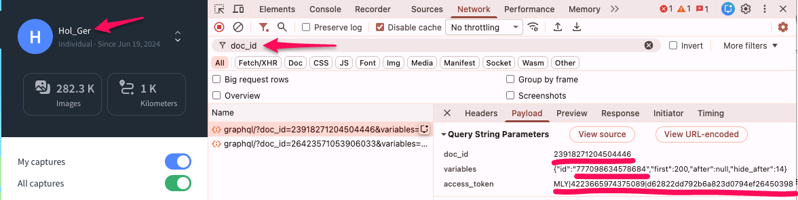
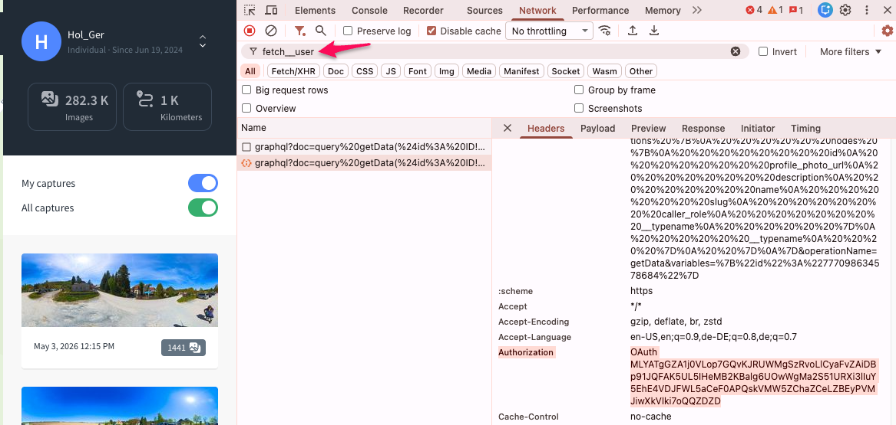
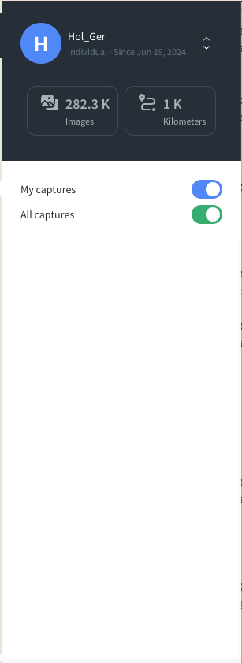

# Delete Mapillary Images per Sequences

Python script to list and bulk-delete your Mapillary sequences.

The project was vibe coded with Claude.

## Setup

```bash
python3 -m venv .venv
source .venv/bin/activate
pip install python-dateutil tzlocal
```

## Configuration

Create `config.json` in the project root (excluded from git):

```json
{
  "doc_id": "23918271204504446",
  "user_id": "your_numeric_user_id",
  "creator_username": "your Mapillary username",
  "app_token": "MLY|4223665974375089|d62822dd792b6a823d0794ef26450398",
  "user_token": "MLY|...",
  "auth_header": "OAuth ..."
}
```

### Determining the configuration settings 

1. Open www.mapillary.com in Chrome
2. Open the Developer Tools
3. Go to the Network tab
4. Load the map by clicking "Explore the map"
4. Filter by doc_id

You will then see this request:




The payload contains **doc_id**, variables {id=[**user_id**], access_token (**app_token**). The **user_name** is displayed in the top-left corner.

**auth_header**: The `Authorization` header value required for deletion. Filter for `fetch__user` in the Developer Tools:




**user_token**: See [Mapillary Client access token (`user_token`)](docs/Tokens.md).

## sequences.py

### List sequences

```bash
python3 sequences.py list
python3 sequences.py list --captured_from "2024-12-01" --captured_to "2024-12-31"
python3 sequences.py list --captured_at "Dec 2, 2024 2:58 PM"
```

Output:

```
sequence                   images   first captured (UTC)         last captured (UTC)
-------------------------------------------------------------------------------------------
PA3dpCEZ2gzySibQo6jXnT         44   2024-12-02 13:03:00 UTC      2024-12-02 13:09:29 UTC
...

Sequences found: 34
```

### Delete sequences

```bash
# Dry run first — always recommended
python3 sequences.py delete --dry-run --captured_from "2024-12-01" --captured_to "2024-12-02"

# Delete with confirmation prompt
python3 sequences.py delete --captured_from "2024-12-01" --captured_to "2024-12-02" --auth_header "OAuth MLY|..."

# Target a single sequence by its browser timestamp
python3 sequences.py delete --captured_at "Dec 2, 2024 2:58 PM" --auth_header "OAuth MLY|..."

# Skip confirmation (for scripting)
python3 sequences.py delete --captured_from "2024-12-01" --captured_to "2024-12-02" --force --auth_header "OAuth MLY|..."
```

### Date formats

All date arguments accept:
- ISO format (interpreted as UTC): `2024-12-02`, `2024-12-02T13:58:00`, `2024-12-02 13:58:00`
- Browser display format (interpreted as local time with DST): `Dec 2, 2024 2:58 PM`

### Time window options

| Option | Behaviour |
|--------|-----------|
| `--captured_at DATETIME` | Sets a 1-minute window around the given timestamp. Use when targeting a single sequence by copying its timestamp from the Mapillary browser. |
| `--captured_from` + `--captured_to` | Explicit window. Both must be provided together. Sequences that started before `captured_from` are flagged and require individual confirmation. |
| _(none)_ | All sequences. |

### Deletion behaviour

- Sequences with images in the time window are listed and confirmed before deletion.
- Sequences whose first image falls **outside** the window (boundary sequences caused by the browser's minute-precision display) are shown with a note and require explicit individual confirmation.
- `--dry-run` shows what would be deleted without making any changes.
- `--force` skips all confirmation prompts.
- `--delay SECONDS` adds an extra pause between deletion requests (default: 10). Deleting sequences in a short space of time may result in the thumbnails not being displayed for a while. See also [Rate Limiting](docs/Tokens.md)



## Logging

All runs are logged to `mapillary.log` (excluded from git), including timings, retry events, and deletion records.